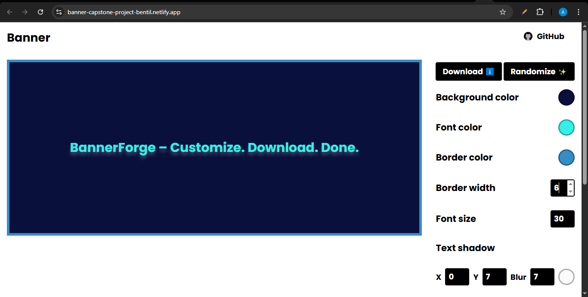
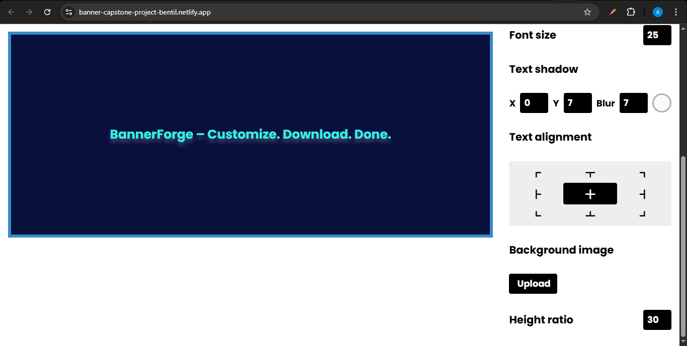

# 🎨 BannerForge

**BannerForge** is a simple and clean banner generator that lets you create customizable banners directly in the browser. You can tweak colors, font sizes, text alignment, border styles, and download your banner as an image.

## 🚀 Live Demo

> [Try it Live](https://banner-capstone-project-bentil.netlify.app/)

## 🖼️ Features

- Edit banner text directly on screen.
- Customize:
  - Background color
  - Font color
  - Border color and width
  - Font size
  - Text shadow (X, Y, blur, color)
  - Text alignment (9-way grid)
  - Background image
  - Banner height ratio
- One-click:
  - Download banner as PNG
  - Generate random styles ✨

## 📷 Screenshot




## 🛠️ Tech Stack

- HTML5
- CSS3 (Custom Properties/Variables)
- JavaScript (Vanilla)
- html2canvas
- Vanilla Picker
- Google Fonts (Poppins)

## 📁 Project Structure

```
BannerForge/
│
├── index.html        # Main HTML layout
├── index.css         # Banner styling and layout controls
├── index.js          # Interactivity, downloads, randomizer, color pickers
├── favicon.ico
├── icons/            # GitHub SVG icon
├── screenshot.png    # preview image
```

## 📦 Setup & Usage

### Clone the Repository

```bash
git clone https://github.com/addobentil/BannerForge.git
cd BannerForge
```

### Open in Browser

Just open `index.html` in your favorite browser.

Or deploy using GitHub Pages:

1. Go to your repo settings.
2. Scroll down to **Pages**.
3. Set source as `main` branch (or whichever one you’re using).
4. Hit Save and your live link will be available!

## ✨ Future Improvements

- Add banner templates
- Save/load banner settings
- Export to SVG
- Social media banner presets (Twitter, LinkedIn, etc.)
- Add drag-to-position text functionality
- Add support for different fonts and styles
